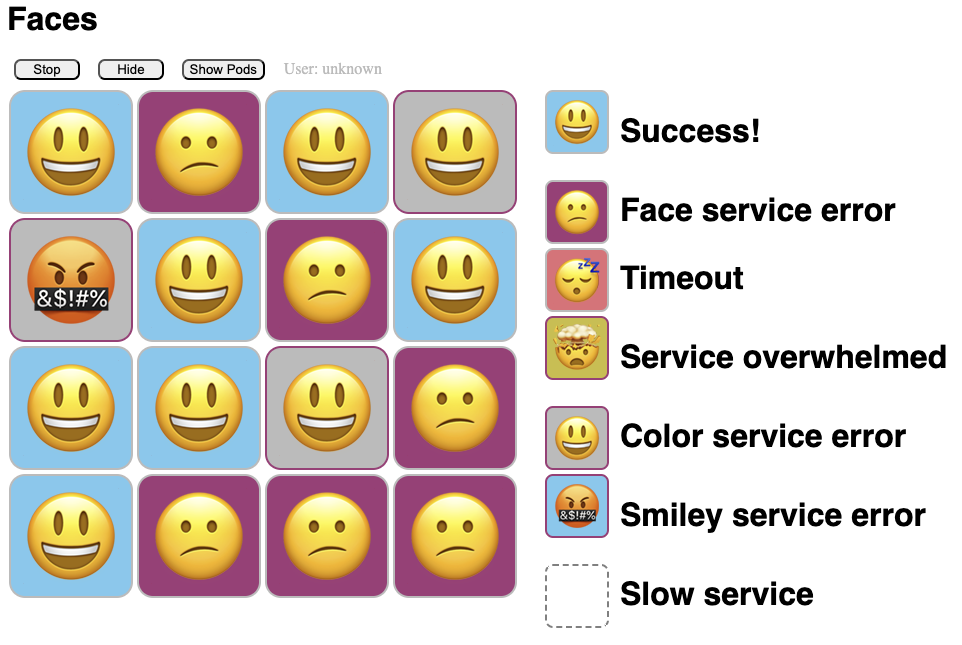

# Faces Demo

This is the Faces demo application. It has a single-page web GUI that presents
a grid of cells, each of which _should_ show a grinning face on a light blue
background. Spoiler alert: installed exactly as committed to this repo, that
isn't what you'll get -- many, many things can go wrong, and will. The point
of the demo is let you try to fix things.

In here you will find:

- `DEMO.md`, a Markdown file containing the resilience demo presented live at
  a couple of events. This uses [Emissary-ingress] and the latest edge release
  of [Linkerd].

- `DEMO-BEL.md`, a Markdown file for the same resilience demo, but using
  [Buoyant Enterprise for Linkerd].

The easiest way to use either demo is to run it with [demosh]. Both demos
assume that you have an empty k3d cluster to play with! If you don't have one,
you can create one with `bash create-cluster.sh` (this will delete any
existing `k3d` cluster named "faces").

**Note**: most of the demo doesn't actually care what kind of cluster you use.
The sole dependency is that, as written, the demo assumes that it will be able
to reach the `emissary-ingress` service in the `emissary` namespace on
localhost port 80. If you're using something other than k3d, you'll need to
tweak the demo to talk to the correct URL.

## To try this yourself:

- Make sure `$KUBECONFIG` is set correctly.

- If you need to, run `bash create-cluster.sh` to create a new `k3d` cluster to
  use.
   - **Note:** `create-cluster.sh` will delete any existing `k3d` cluster named
     "faces".

- To run the demo as we've given it before, check out [DEMO.md]. The easiest
  way to use that is to run it with [demosh].

## Architecture

The Faces architecture is fairly simple:

- The `faces-gui` workload, reached on the `/faces/` path, just returns the
  HTML and Javascript for the GUI. The GUI is a single-page webapp that
  displays a grid of cells: for each cell, the GUI calls the `face` workload.

- The `face` workload, reached on the `/face/` path, calls the `smiley`
  workload to get a smiley face and the `color` workload to get a color. It
  then composes the responses together and returns the smiley/color
  combination to the GUI for display.

  `face` uses HTTP to talk to `smiley` and gRPC to talk to `color`.

- The `smiley` workload returns a smiley face. By default, this is a grinning
  smiley, U+1F603, but you can set the `SMILEY` environment variable to any
  key in the `Smileys` map from `constants.go` to get a different smiley.

- The `color` workload returns a color. By default, this is a light blue, but
  you can set the `COLOR` environment variable to any key in the `Colors` map
  from `constants.go` to get a different color, or to any arbitrary hex color
  code (e.g. `#ff0000` for bright red).

  The named colors in the `Colors` map are meant to work for normal color
  vision as well as for various kinds of colorblindness, and are taken from
  the "Bright" color scheme shown in the "Qualitative // Color Schemes"
  section of https://personal.sron.nl/~pault/. For (much) more information,
  read the comments in `pkg/faces/constants.go`. Feedback here is welcome,
  since the Faces authors have normal color vision...

[Linkerd]: https://linkerd.io
[Buoyant Enterprise for Linkerd]: https://buoyant.io/linkerd-enterprise
[Emissary-ingress]: https://www.getambassador.io/docs/emissary/
[DEMO.md]: DEMO.md
[demosh]: https://github.com/BuoyantIO/demosh
