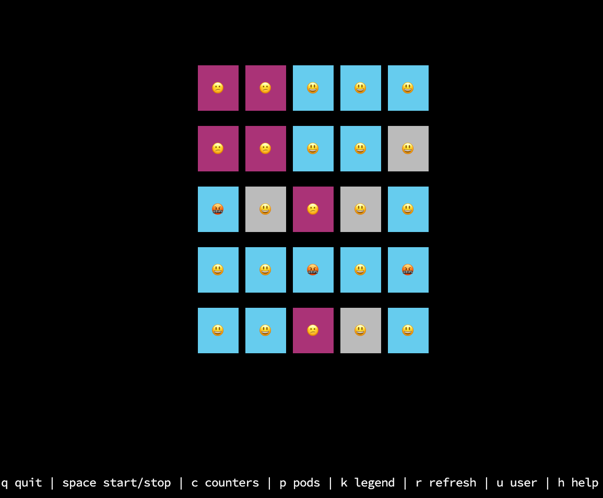

# faces-tui

A terminal UI replacement for the [Faces demo](https://github.com/BuoyantIO/faces-demo) GUI. `faces-tui` renders the same live center/edge grid, color and smiley mapping, timeout counters, legend, and pod view as `faces-gui` — entirely from the command line, with no browser required.



## Requirements

- Python 3.8 or later
- A terminal with 24-bit (truecolor) ANSI support and emoji rendering
- A running Faces demo endpoint

No third-party packages are needed; `faces-tui` uses only the Python standard library.

## Installation

Copy `faces-tui` somewhere on your `$PATH` and make it executable:

```sh
chmod +x faces-tui
cp faces-tui /usr/local/bin/
```

## Quick start

```sh
# Auto-detect endpoint style and render a 5×5 grid
faces-tui http://faces-gui.faces.svc.cluster.local

# Point directly at the face service
faces-tui http://172.20.47.122 --mode direct

# Match the default faces-gui grid shape from the Helm chart (4×4)
faces-tui http://172.20.47.122 --rows 4 --cols 4 --edge-size 1
```

## How it works

`faces-tui` replicates the behavior of `faces-gui` exactly:

- The grid is divided into a center region and an outer edge ring, controlled by `--rows`, `--cols`, and `--edge-size`. Center cells call the `center` endpoint; edge cells call the `edge` endpoint.
- Responses are parsed and rendered using the same visual rules as `assets/html/faces.js`: colors, smileys, border highlights, and timeout counters all follow the same logic.
- The `X-Faces-Pod` response header is used to populate the optional pod panel, with the same short-name (`first-last`) format as the GUI.
- Requests are spread across the paint interval (default 2000 ms) with per-row and per-cell staggering, matching `faces-gui`'s `ROW_INTERVAL` / `CELL_INTERVAL` behavior.

## Endpoint modes

`faces-tui` supports three endpoint styles. The default `auto` mode probes each style in order and uses the first one that returns a valid Faces response.

| Mode | URL pattern | When to use |
|------|-------------|-------------|
| `gui-proxy` | `<base>/face/center/`, `<base>/face/edge/` | Pointing at a `faces-gui` pod (it proxies `/face/` to the face service) |
| `direct` | `<base>/center/`, `<base>/edge/` | Pointing directly at a `faces-face` pod |
| `root` | `<base>` | Simple test endpoints or custom setups |
| `auto` | probes `gui-proxy` → `direct` → `root` | Default; works for most cases |

## Visual mapping

The grid cells use the same color and smiley rules as `faces-gui`:

| Display | Smiley | Background | Border |
|---------|--------|------------|--------|
| Success | 😃 grinning | Blue `#66CCEE` | Grey |
| Face service error | 😕 confused | Purple `#AA3377` | Grey |
| Timeout / rate limit | 😴 sleeping | Red `#EE6677` | Grey |
| Service overwhelmed | 🤯 kaboom | Yellow `#CCBB44` | Purple |
| Color service error | 😃 grinning | Grey `#BBBBBB` | Purple |
| Smiley service error | 🤬 cursing | Blue `#66CCEE` | Purple |
| Slow / stale | *(dim)* | — | Grey |

A small counter in the bottom-right corner of a cell shows how many consecutive timeout-style responses it has received. After five consecutive timeouts the cell switches to the "overwhelmed" display.

## Keyboard controls

| Key | Action |
|-----|--------|
| `q` or `Ctrl-C` | Quit |
| `Space` | Start or stop requests |
| `c` | Show or hide timeout counters |
| `p` | Show or hide pod panel |
| `k` | Show or hide legend |
| `r` | Force-refresh all cells immediately |
| `u` | Change the user header value |
| `h` or `?` | Show or hide keyboard help overlay |

## Environment variables

These variables mirror the ones recognized by `faces-gui`, making it easy to drop `faces-tui` into the same Kubernetes environment:

| Variable | Default | Description |
|----------|---------|-------------|
| `NUM_ROWS` | `5` | Grid rows |
| `NUM_COLS` | `5` | Grid columns |
| `EDGE_SIZE` | `1` | Edge ring thickness |
| `SHOW_COUNTERS` | `true` | Show timeout counters on startup |
| `SHOW_PODS` | `false` | Show pod panel on startup |
| `HIDE_KEY` | `true` | Hide the legend on startup (set to `false` to show it) |
| `START_ACTIVE` | `true` | Begin requesting immediately |
| `FACES_USER` | `unknown` | Value sent in the user header |
| `USER_HEADER_NAME` | `X-Faces-User` | Header name for the user value |

> **Note on `HIDE_KEY`:** `faces-gui` defaults to showing the legend; `faces-tui` defaults to hiding it for a cleaner terminal view. Set `HIDE_KEY=false` (or pass `--show-key`) to match `faces-gui` behavior.

## All options

```
usage: faces-tui [-h] [--mode {auto,gui-proxy,direct,root}]
                 [--rows ROWS] [--cols COLS] [--edge-size EDGE_SIZE]
                 [--paint-interval-ms PAINT_INTERVAL_MS]
                 [--refresh-interval REFRESH_INTERVAL]
                 [--workers WORKERS] [--timeout TIMEOUT]
                 [--tile-width TILE_WIDTH] [--tile-height TILE_HEIGHT]
                 [--col-gap COL_GAP] [--row-gap ROW_GAP]
                 [--emoji-width EMOJI_WIDTH]
                 [--error-mode {faces,status}]
                 [--show-counters | --hide-counters]
                 [--show-pods] [--show-key] [--show-borders]
                 [--fade | --no-fade]
                 [--max-solid-ms MAX_SOLID_MS]
                 [--max-visible-ms MAX_VISIBLE_MS]
                 [--header] [--once] [--no-alt-screen]
                 [--start-active | --start-paused]
                 [--user USER] [--user-header USER_HEADER]
                 [--user-agent USER_AGENT]
                 [url]
```

| Option | Default | Description |
|--------|---------|-------------|
| `url` | *(required)* | Base Faces URL |
| `--mode` | `auto` | Endpoint style: `auto`, `gui-proxy`, `direct`, or `root` |
| `--rows` | `NUM_ROWS` or `5` | Grid rows |
| `--cols` | `NUM_COLS` or `5` | Grid columns |
| `--edge-size` | `EDGE_SIZE` or `1` | Edge ring thickness |
| `--paint-interval-ms` | `2000` | Per-cell request interval (ms) |
| `--refresh-interval` | `0.2` | Terminal redraw interval (seconds) |
| `--workers` | `10` | Max concurrent HTTP requests |
| `--timeout` | `3.0` | Per-request HTTP timeout (seconds) |
| `--tile-width` | `6` | Tile width in terminal columns |
| `--tile-height` | `3` | Tile height in terminal rows |
| `--col-gap` | `1` | Columns between tiles |
| `--row-gap` | `1` | Rows between tiles |
| `--emoji-width` | `2` | Terminal column width assumed for emoji |
| `--error-mode` | `faces` | `faces` uses GUI visuals; `status` prints raw HTTP status codes |
| `--show-counters` / `--hide-counters` | show | Timeout counter visibility |
| `--show-pods` | off | Start with pod panel visible |
| `--show-key` | off | Start with legend visible |
| `--show-borders` | off | Draw tile borders using faces-gui border color logic |
| `--fade` / `--no-fade` | no-fade | Fade stale cells like faces-gui |
| `--max-solid-ms` | `2000` | Age (ms) at which fading begins |
| `--max-visible-ms` | `2500` | Age (ms) at which a faded cell disappears |
| `--header` | off | Show URL, mode, user, and key hints at the top |
| `--once` | off | Fetch one full grid and exit |
| `--no-alt-screen` | off | Render in the current terminal instead of an alternate screen |
| `--start-active` / `--start-paused` | active | Whether to begin requesting immediately |
| `--user` | `FACES_USER` or `unknown` | Value sent in the user header |
| `--user-header` | `USER_HEADER_NAME` or `X-Faces-User` | Header name for the user value |
| `--user-agent` | `faces-tui/1.0` | User-Agent header value |

## Examples

```sh
# Basic usage — auto-detect endpoint style
faces-tui http://faces-gui.faces.svc.cluster.local

# Direct to a face service pod, matching the Helm chart default grid
faces-tui http://172.20.47.122 --mode direct --rows 4 --cols 4 --edge-size 1

# Show pod panel, legend, and URL header bar
faces-tui http://172.20.47.122 --show-pods --show-key --header

# Display raw HTTP status codes instead of emoji on errors
faces-tui http://172.20.47.122 --error-mode status

# Fetch one grid snapshot and print it inline (no alternate screen)
faces-tui http://172.20.47.122 --once --no-alt-screen

# Start paused; press Space when ready
faces-tui http://172.20.47.122 --start-paused

# Send requests as a specific user
faces-tui http://172.20.47.122 --user jason --user-header X-Faces-User
```
